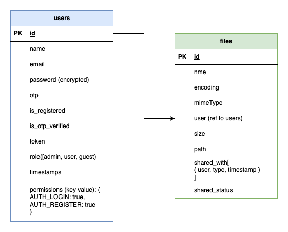

# File Sharing

## Project Overview
Secure file sharing web application. It allows users to upload, download & share files with others.

---

## System Requirements
Ensure your system meets the following requirements before proceeding:

- **Node.js**: v21.2.0 or higher
- **npm/yarn**: Latest version
- **MongoDB**: v4.0 or higher (for backend database)
- **Browser**: Chrome/Edge/Firefox (latest version)
- **Operating System**: Windows/Linux/MacOS (any with appropriate Node.js support)

---

## Installation Instructions
In Github, client & server reside under the same directory, so just clone the parent one.
1. Clone the repository:
   ```bash
   git clone https://github.com/your-repo-url.git

### Backend (BE)

1. Change directory:
    ```bash
    cd server
2. Install dependencies:
   ```bash
   npm install
3. Start the backend server:
    ```bash
   npm run dev

No need to setup any envs, already set default db, mail service & firebase storage. If you want to change service, you can update mongo db, mail & storage service.

### Frontend (FE)

1. Change directory:
    ```bash
    cd client
2. Install dependencies:
   ```bash
   npm install
3. Start the clinet:
    ```bash
   npm run dev

## Running Instructions
Once setup is done, db string is updated in the env, we are ready to go, we can now start our server
### Backend (BE)
-  Start the backend server: (starts at 3000 PORT)
    ```bash
   npm run dev

### Frontend (FE)
-  Start the backend server:
    ```bash
   npm run dev

## DB Schema

